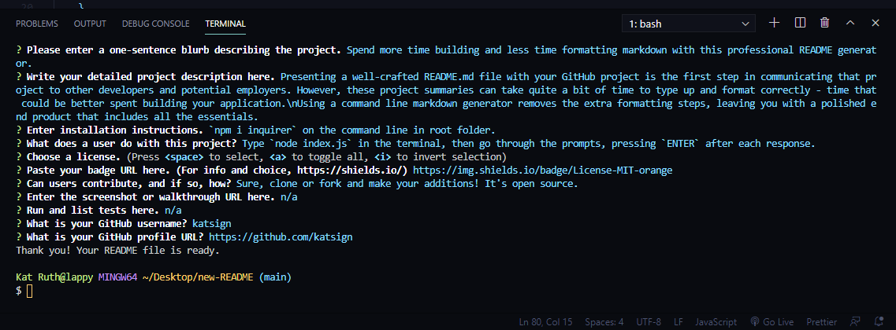

# Node README Generator :speech_balloon:

### Spend more time building and less time formatting markdown with this professional README generator.

## *Table of Contents*

- [Description](#description)
- [Installation](#installation)
- [Usage](#usage)
- [Screenshots](#screenshots)
- [Contributing](#contributing)
- [Tests](#tests)
- [Questions](#questions)

## *Description*
Presenting a well-crafted README.md file with your GitHub project is the first step in communicating that project to other developers and potential employers. However, these project summaries can take quite a bit of time to type up and format correctly — time that could be better spent building your application. 

Using a command line markdown generator removes the extra formatting steps, leaving you with a polished end product that includes all the essentials.

## *Installation*
`npm i inquirer` on the command line in root folder.

## *Usage*
Type `node index.js` in the terminal, then go through the prompts, pressing `ENTER` after each response.

## *Screenshots*

<!-- blank line -->
<figure class="video_container">
  <iframe src="https://player.vimeo.com/video/511197007" frameborder="0" allowfullscreen="true"> </iframe>
</figure>
<!-- blank line -->

## *Contributing*
Contributions are welcome, feel free to clone or fork and make your additions! It's open source.

## *Tests*
n/a

## *Questions?*
- My Profile: [katsign](https://github.com/katsign)

---
This project is MIT licensed. &copy; 2021